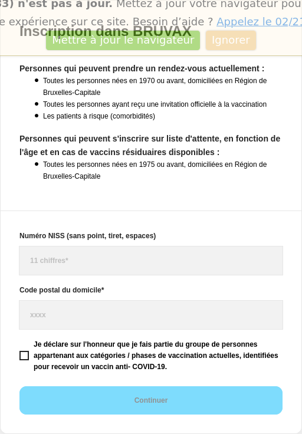

Inscription dans BRUVAX
-----------------------

### Personnes qui peuvent prendre un rendez-vous actuellement :

*   Toutes les personnes nées en 1970 ou avant, domiciliées en Région de Bruxelles-Capitale
    
*   Toutes les personnes ayant reçu une invitation officielle à la vaccination
    
*   Les patients à risque (comorbidités)
    

### Personnes qui peuvent s'inscrire sur liste d'attente, en fonction de l'âge et en cas de vaccins résiduaires disponibles :

*   Toutes les personnes nées en 1975 ou avant, domiciliées en Région de Bruxelles-Capitale
    

* * *

Numéro NISS (sans point, tiret, espaces)

Code postal du domicile\*

Je déclare sur l'honneur que je fais partie du groupe de personnes appartenant aux catégories / phases de vaccination actuelles, identifiées pour recevoir un vaccin anti- COVID-19.Continuer

[Source](https://bruvax.brussels.doctena.be/)